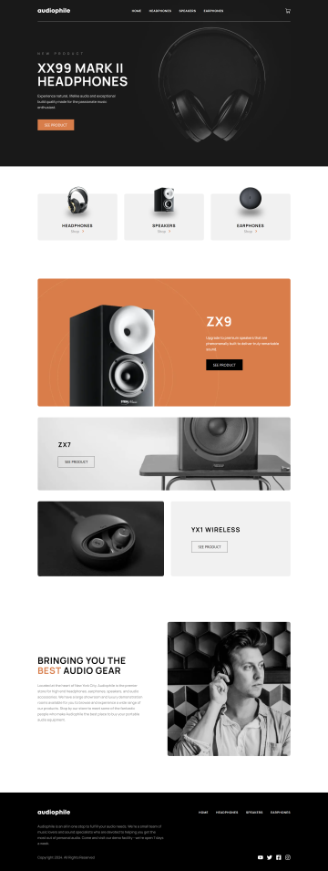
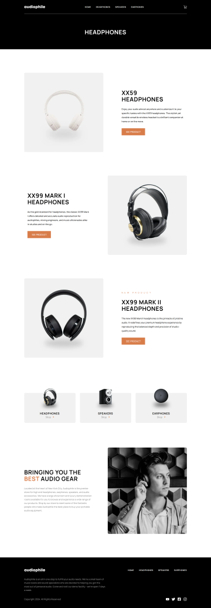
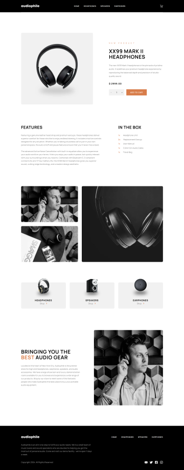
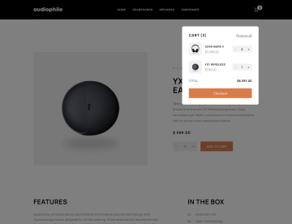
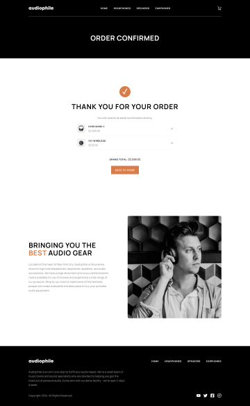
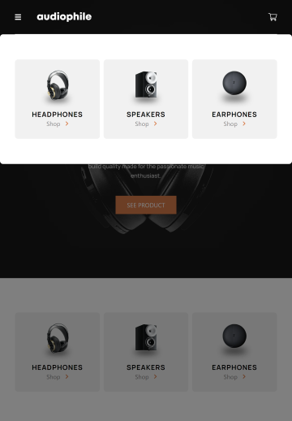
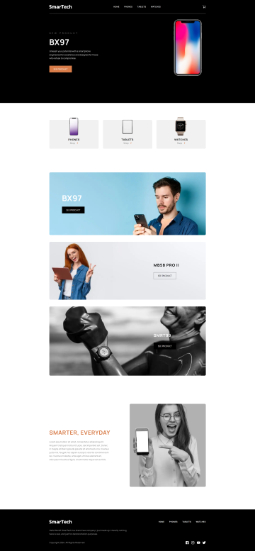
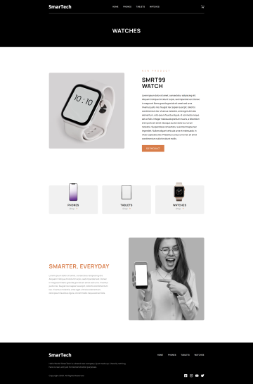
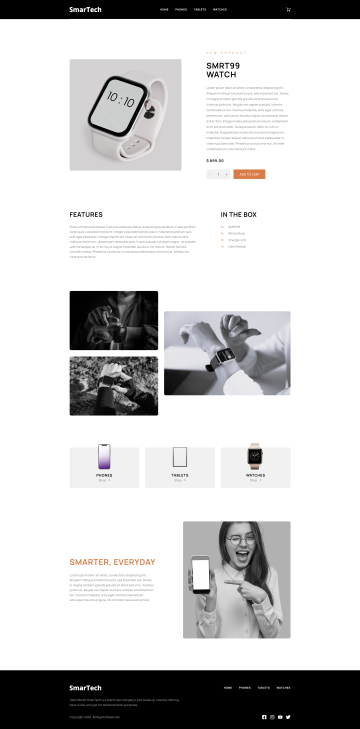

# Audiophile Customizable E-Commerce

This project is an e-commerce website built for an audio systems company store using  **Next.js**, **Tailwind CSS**, and  **Sanity CMS**. The website is designed to be fully customizable, enabling quick transformation into a completely different store with minimal effort (provided the necessary assets are available). The checkout functionality is integrated using  **Stripe's Checkout Mode API** .

## Features

* **Fully Customizable Content** :
  * Using Sanity CMS studio, all aspects of the website can be easily customized by marketing/designer team without redeployment.
  * Change product names, images, descriptions, features and in-the-box accessories and product categories within minutes.
  * Modify the call-to-action (hero) image & product, promoted products on home page, footer text & image, and social media links directly from the Sanity CMS Studio.
  * For flexibility either a single sized responsive image or multiple images for different device sizes can be used. (Desktop, tablet or mobile) The system defaults to desktop image for all device sizes if specific image for device size is not uploaded through Sanity CMS Studio.
* **Modern Tech Stack** :
  * Built with **Next.js** for server-side rendering and optimized performance.
  * Styled with **Tailwind CSS** for a responsive and modern user interface.
  * Content text and images are configured/pulled from **Sanity CMS** using Sanity's own **GROQ** query language (An open-source GraphQL like query language).
* **Secure Checkout** :
  * Integrated with **[Stripes Checkout Mode API](https://docs.stripe.com/payments/checkout)** .
  * The checkout is in **test mode**, allowing orders to be placed using Stripe's [test card numbers](https://docs.stripe.com/testing#international-cards).

## Screenshots

| Home                                                                       | Categories                                                                             | Product                                                                             | Cart                                                           | Confirmation                                                                                   | Navigation (Tablet/Mobile)                                                               |
| -------------------------------------------------------------------------- | -------------------------------------------------------------------------------------- | ----------------------------------------------------------------------------------- | -------------------------------------------------------------- | ---------------------------------------------------------------------------------------------- | ---------------------------------------------------------------------------------------- |
|  |  |  |  |  |  |

## Demo Customization Screenshots

To demonstrate the full flexibility and power of the system, I will showcase a **demo customization** where the e-commerce site is transformed from an audio systems store into a **generic tech store**. This version features products such as phones, tablets, and smartwatches. All of these changes are done seamlessly through the **Sanity CMS** without any code modifications, highlighting the ease of rebranding and restructuring.

| Home | Categories | Product |
| ---- | ---------- | ------- |
|  |  |  |
